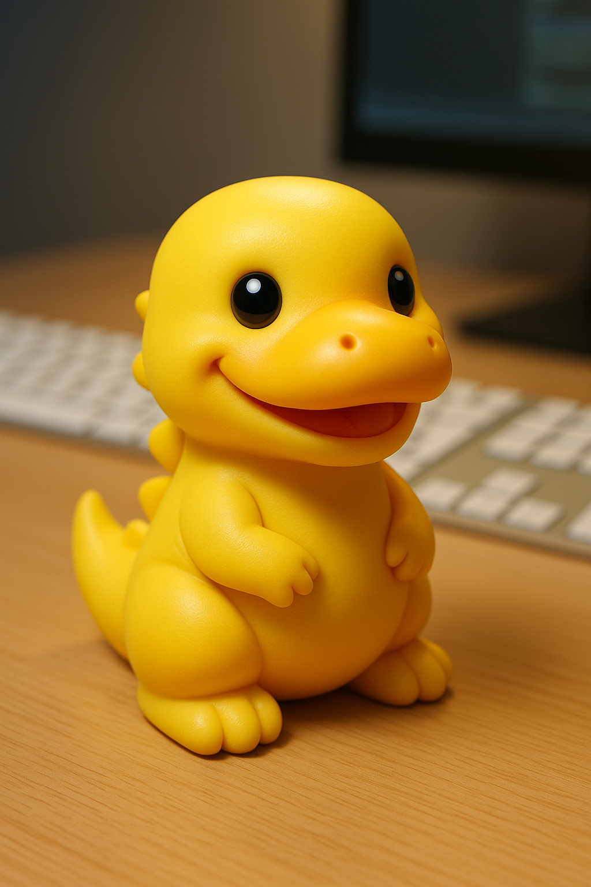

<!DOCTYPE html>
<html lang="en">
<head>
    <meta charset="UTF-8">
    <meta name="viewport" content="width=device-width, initial-scale=1.0">
    <title>About Me :Dex the Duckasaurus 🦆🦕</title>
</head>
<body>
    <h1>
        About Me
    </h1>
    

    

        Hi everyone, my name is Dex and I am a Duckasaurus. That means I'm part dinosaur, part programmer, and part rubber duck!
    

    
<h2>
    My Favourite Things
</h2>

<ul>
    <li>
        Floating in the bathtub
    </li>
    <li>
        Writing HTML code
    </li>
    <li>
        Eating yummy snacks
    </li>
</ul>
<h2>
    Check out my favorite website
</h2>

<a href="https://www.google.com/?authuser=0">Go to Google!</a>
<h2>
    I want to go to space 
</h2>
<a href="https://www.nasa.gov/">Read about NASA here.</a>
</body>
</html>
